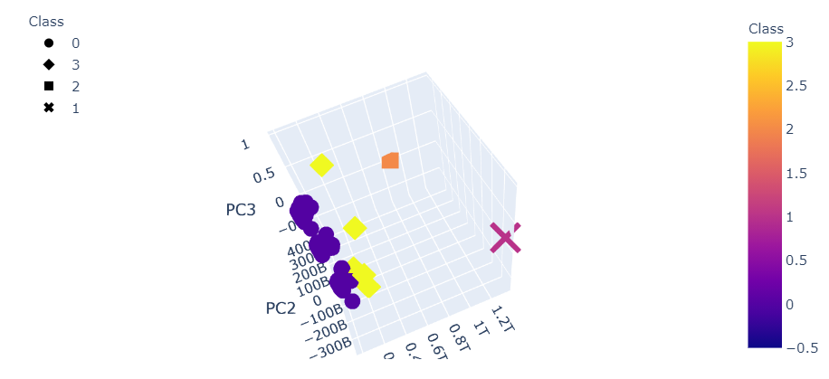

# Cryptocurrencies

In this repository, we use principal component analysis (PCA) to reduce the dimensionality of the cryptocurrency data and then use unsupervised machine learning from sklearn's kmeans dependency to cluster the data.

We can see the result of the analysis in the following 3-D visualization.

